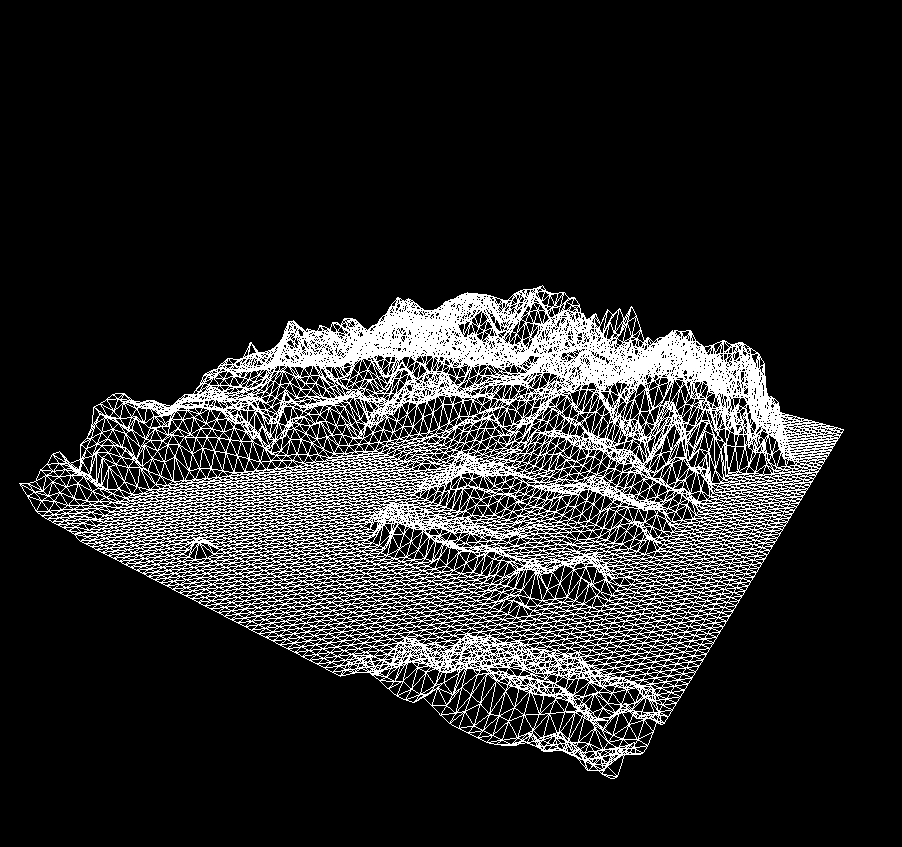
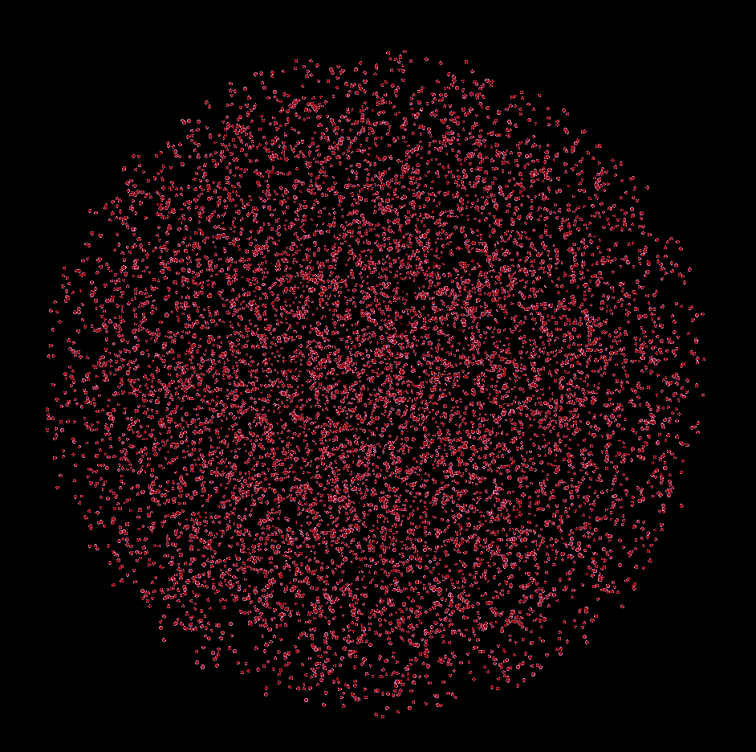
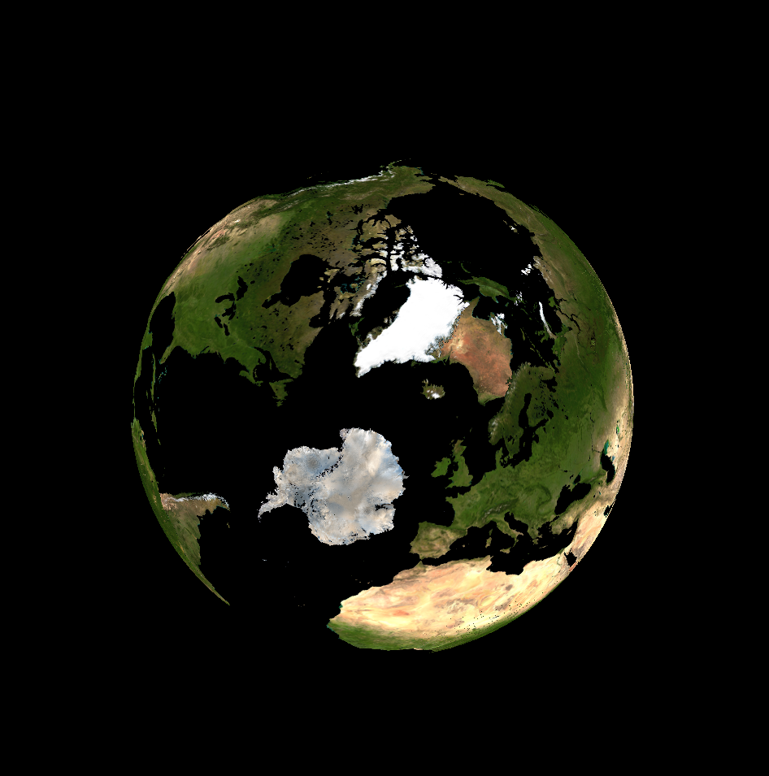

.. LISA documentation master file, created by
   sphinx-quickstart on Sat May 23 16:48:39 2015.
   You can adapt this file completely to your liking, but it should at least
   contain the root `toctree` directive.

Welcome to LISA's documentation!
================================

.. toctree::
    :maxdepth: 2

    Events documentation<events/events>

Indices and tables
==================

* :ref:`genindex`
* :ref:`modindex`
* :ref:`search`

